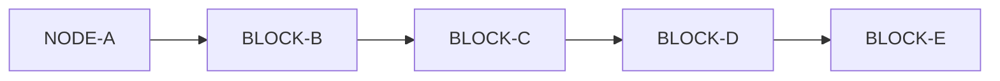
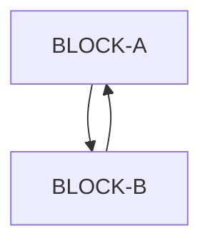
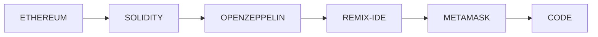

### Target Audience

Those who are new to the web3 world or have some experience in Ethereum(Solidity) development

### Motive

This is a really fast way to get started with coding in **Ethereum** Blockchain and does not include an in-dept concept
visit
but rather focus on covering as many topics as possible.

**Ethereum** is one of the many other blockchains out there e.g. Solana, Flow, Near etc.
There tutorials are specific to Ethereum Blockchain.

## Introduction

[Read Basics here](./basics/theory/BASICS.md)

| Content                       | Description                                                                     |
|-------------------------------|---------------------------------------------------------------------------------|
| Web Era                       | Web 1.0, 2.0, 3.0                                                               |
| Blockchain                    | Distributed Decentralized Ledger                                                |
| Gas Fee                       | Base + Priority (Tip)                                                           |
| Mining                        | Creating a new block                                                            |
| Block                         | Transactions and many more                                                      |
| Chain                         | Orderly arrangement of blocks                                                   |
| Storage                       | Permanent & Ephemeral                                                           |
| Double Spending Problem       | How blockchain handles it.                                                      |
| 51% Attack                    | Towards Centralization                                                          |
| Consensus                     | To agree upon the system and block state                                        |
| Byzantine's General Problem   |                                                                                 |
| HashCash                      | Email Spamming                                                                  |
| POW                           | Proof of Work                                                                   |
| POS                           | Proof of Stake                                                                  |
| Account & Wallet              | How accounts are created and how wallets manage them                            |
| Smart Contract                | The agreement to behave as expected                                             |
| FT & NFT                      | Fungible & Non Fungible                                                         |
| ERC 20, 721, 721A, 1155       | IERC Standards implementations                                                  |
| Openzeppelin                  | Smart Contracts Framework                                                       |
| Infura                        | RPC to interact with Ethereum network, unless you decide to setup your own node |
| DAO                           | Decentralized Organisation                                                      |
| DAPP                          | Decentralized Application                                                       |
| DEFI                          | Decentralized Financial Institution                                             |
| DEGI                          | Decentralized Gaming                                                            |
| Remix                         | Ihe solidity IDE                                                                |
| Brownie (Truffle)             | Python Testing Framework (help you setup (local) / link accounts)               |
| Hardhat                       | NodeJS Ethereum Development Environment                                         |
| IPFS                          | Inter Planetary File System                                                     |
| Pinata                        | NFT Media Management / Storage                                                  |
| web3.storage                  | NFT Media Management / Storage                                                  |
| Side Chain (Layer 2 Solution) | Polygon (Matic) & many more                                                     |
| EVM                           | Ethereum Virtual Machine                                                        |
| Testnet (Faucets)             | To test before you go live as you can't rollback                                |
| Security                      | Re-Entrance, Ethernaut and many more                                            |
| Audit                         | Finding Security Breach                                                         |
| OpenSea                       | Digital Marketplace                                                             |
| Ethernaut                     | The Solidity Hacks                                                              |
| FAQ                           | Why? What? How?                                                                 |
| Userful Links                 | To explore more                                                                 |
| Youtube Channels              | For in-depth knowledge                                                          |

## Solidity Basics

| Content                      | Description                                       |
|------------------------------|---------------------------------------------------|
| ERC20                        | IERC20 Implementation                             |
| ERC721                       | IERC721 Implementation                            |
| ERC721A                      | Improved version of 721 (not aggressively tested) |
| ERC1155                      | IERC1155 Implementation                           |
| Airdrop                      | Mint on behalf                                    |
| Event                        | Let the outside world know the changes            |
| Event Topic                  | Web 1.0, 2.0, 3.0                                 |
| Commission                   | Commission per transaction (multiple splits)      |
| Royalty                      |                                                   |
| Merkle Tree                  | The cryptography used for whitelisting            |
| Modifier                     | Modify before / after leaving                     |
| Mapping                      | Key - value                                       |
| Data Types                   | Struct, Array and many more                       |
| Subscribing to events        | Polling and websocket                             |
| Re-Entrance Guard            | Extra precaution                                  |
| Smart Contract Communication | Calling another Smart Contract function           |
| Total - Max Supply           | What is total & max supply of Bitcoin & Ethereum? |
| Transferring Ownership       | Transferring ownership of NFT                     |
| Approve & Approve All        |                                                   |
| Multiple Inheritance         | How multiple inheritance is resolved              |
| Virtual                      |                                                   |
| Pure and View                | Why read is gas free?                             |
| Storage - Callable - Memory  | Variables Storage                                 |
| Private                      | Is is really private?                             |
| keccak256                    | Is is really private?                             |
| constructor                  | Is constructor code a part on bytecode?           |
| Burnable                     | Burning a Token                                   |
| Withdraw                     | Ensure the funds can be withdrawn                 |
| Transaction Properties       | E.g. `msg.sender`                                 |
| Testing                      | PyTest: Auto deploy / mint token                  |
| Signing                      | Signing a transactions                            |
| Merkle Tree                  | How it helps with pre-whitelisting (Coupons)      |
| Whitelisting                 | Merkle root - proof                               |
| On Chain Verification        | Instant Whitelisting                              |
| Flatter                      | Flatten all files into one                        |
| Visualize                    | Visualizing smart contract functions flow         |
| Contract Verification        | Smart Contract Code Verification                  |
| Library                      |                                                   |
| Destroy                      | Destroy a Smart Contract                          |
| Verifications                | Verify an action has been performed by user       |
| OpenSea                      | How OpenSea know about your token instantly?      |

## Solidity Intermediate

| Content                      | Description                                         |
|------------------------------|-----------------------------------------------------|
| OpenSeat Token Metadata      | Adding more information to your NFT                 |
| Custodial Wallet             | Chat are custodial wallets and how are they created |
| On Contract Media Storage    | Storing small files in Smart Contract (Bytes)       |
| Staking                      | Funds Staking                                       |
| Token Exchange / Split       | Exchange / Split token for other                    |
| Upgradable Smart Contract    | How immutable is made mutable                       |
| MultiSig Wallet              |                                                     |
| Application Binary Interface | ABI & Creating your own GUI using ABI               |

### Web 1.0:

In the 1990's with `Netscape` (web browser) bought the era of static web pages

### Web 2.0:

The introduction of `Mobile Internet` | `Social Network` | User of `HTTPS` to fetch data from various centralized data
sources
bought the era of **web2**

In **web2** to fetch data, permissions are required as data is centralized
into various organisations database systems like Google, AWS, Alibaba, Netflix etc.
Also, there can be government restrict to access to data in certain regions / times and can monitor and control data
flow,
Big players usually defines rules

### Web 3.0

Data is distributed and decentralized and even if one organisation decides to shut down its servers, the data will still
be available.
(unless the whole network nodes decides to shut down) Nodes can't refuse to upgrade to new regulations.

**Web3** Has its own pros and cons.

### Blockchain

Decentralized Distributed Ledger (Public or Private)

#### Chain of Blocks of transactions (Blocks order matters)



### Peer-to-Peer connection



### Understanding basics with a short story

**Assumption:**
Let `P1` & `P2` be to person with a **joint** account in `B` Bank with initial balance of $100 and
both `P1` & `P2` do some transactions (_can be in parallel_) and say `P1` withdrew **$70** followed by `P2` trying to
withdraw
another **$70**.

It is the `B` Banks who manages and maintain the system state (transaction orders: _Credit / Debit_)
and for the services that the `B` bank provide the bank collects `x` percent amount per transaction
done by `P1` & `P2` in order to continue its day to day operations.

Once a transactions has been processed and logged by the bank, their order can no longer be altered.

Let's say you have 10 pages of your passbook printed with list of transactions made, and you decide to replace last page
with the first, the bank will
verify the same with the transactions ledger in their system and if invalid, will nullify it.

In the above scenario, the whole system trust relies on `B` bank to do its duty as per the guidelines and protocols
which makes the whole system centralized to `B` bank. If the bank for some reason decides to seize `P1` and `P2`'s
account,
in that scenario `P1` and `P2` will lose access to their data.

> **Transaction Ledger:** Book or collection of accounts in which account transactions are recorded

> **Distributed:** Disbursement of assets / data

> **Decentralized:** Not controlled by single entity

> **Example:** The India government decided to ban popular social media platform `Tik-Tok` leading to thousands of users
> loosing their hard-earned followers data as the database was centralized and owned by `Tik-Tok` whose access was
> restricted.

### Gas Fee [Base + Priority]

Fee paid per transaction to `B` bank to manage the system state (transaction ledger).
(**Note:** Base and Priority fee are later explained)

[Ethereum Gas fee for each op-code](https://ethereum.org/en/developers/docs/evm/opcodes/)

### Mining / Creating

As in practical world the number of users that the bank has to manage is high and transactions number can be in *
*millions**,
and as each individual hardware system has its own limits to put all transactions in a single system won't be feasible
(vertical scaling has its limits), so to keep the system scale to more transaction
the bank `mines` (creates) a new hardware system to hold the new transactions (_OLAP / OLTP_)

> Mining is a process of creating and adding a block of transactions to the blockchain network of Ethereum.

### Can anyone become miner?

To become a miner you will need hardware & Networking system connected to Ethereum Mainnet with Ethereum Virtual
machine (EVM)
installed into it and then to load all the transaction ledger so far in the system.
The EVM ensures that the system complies with the Ethereum protocols (_e.g. consensus algorithm: Later explained._)

### How can we make the whole system decentralized?

1. Not allowing `B` bank to always mine and manage the transactions
2. Bringing consensus in the whole system that makes all node agree upon the system state (_more than 51% consensus: 51%
   attack_)

> **Consensus Algorithm:** A process used to achieve agreement on a single data value among distributed processes or
> systems

### Block

**Assumption:** Our Bank passbook represents the whole transaction ledger

Each page full (_or partially full_) of transactions will represent a block of transactions.

What is in a block? (_later explained_)

| Content      | Description                                                       |
|--------------|-------------------------------------------------------------------|
| Timestamp    | Block creation time                                               |
| Block Number | Representing length of blockchain                                 |
| Base Fee     | Minimum gas fee paid to process all the transactions              |
| Difficulty   | Depending of congestions how hard to find nonce (later explained) |
| Parent Hash  | Hash of previous block                                            |
| Transactions | All transactions added to the block                               |
| State Root   | Compete system state (accounts balance / nonce etc)               |
| Mix Hash     | Unique Block Identifier                                           |
| Nonce        | Proving Proof of Work is done                                     |

**Why blocks has a certain limit?** (15-30 Million Gas)
So as the low resource nodes can keep up with the system.

### Chain

Chain represents orderly arrangement of blocks

### Gas Fee revisit [Base & Priority (tip to miner)]

Unlike centralized systems where transactions are immediately processed (_generally speaking_),
in **Ethereum**, the transactions are stores in a pool (**mempool**) waiting for the miner to pick them and add them to
a newly minted block

**Base Fee (Mandatory):** Since processing transaction costs resources (_a user might request to run an infinite loop_),
the base fee is a compensation that cost which post process is burnt (destroyed).

**Priority Fee (Optional):** A miner would be looking for processing the heavy gas fee transactions first to maximise
his profit,
so to lure miner to process transactions first, a priority fee is added.

This leads to various problems:

1. Giving only Base gas fee might lead to your transaction never being picked up by the miner and will never be
   processed.
2. Even if you submit the transaction first, someone else can pay higher priority fee and the miner can choose to
   process
   the more priority free before yours (even if both are added to same block)
3. The miner can choose the transactions order for the block
4. There is no surety of transaction processing.

> View transactions waiting in pool to be added to new block: [txstreet.eth](https://txstreet.com/v/eth)

### Storage

1. Permanent: Transactions data etc.
2. Ephemeral: Accounts Balance, Smart Contract (can be destroyed) etc.

### Consensus Mechanism (POW / POS etc)

This helps ensures that all node on blockchain network are synchronized and agree upon which transaction can be added to
blockchain and ensures that each node follows same rules. This ensures that the miner do not put false transactions
in the newly minted block.

Note: Miner is allowed to add transaction as follows:

> Address 0 -> Miner Address transfer 6.5 ETH as a reward for mining a new block (providing resources)

> A new block is minted every ~12 seconds

**Byzantine's General Problem:**
[Youtube](https://www.youtube.com/watch?v=A-mNgqJETQg)

To come to a consensus means at-least 51% (_51% attack problem_) nodes agree on the system state

**What if someone somehow controls more than 51% of nodes?**
As to reach consensus 51% votes for Miners & Verifier Nodes are required. This would lead to a centralized system.

### HashCash (by BlackAdam: 1997)

Assumption: We have a mail system which we need to protect form email spammers.

Let's say we update and make the system require user to do some work say to solve a computational problem that required
`0.01` second for each mail sent in order to send an email. For user sending `~10` mails,
this time delay will be hard to notice but the spammer who need to send 10 Million mails will face a significant delay.

> **bCrypt:** Delayed (exponential) encryption algorithm

### Proof of work

**Given:** Let us say you are asked to find a number (brute force guessing is the only way to find it) which when hashed
with `H` givers result `R`.

Let you need to find a number (**nonce**) such that when hashed with `H` the result `R` will have `n` number of leading
zeros,
depending on the congestion (miners trying to find the number), increasing the `n` will increase the difficulty.

```Nonce + Current Block Data + Previous Block Hash => Hash with Leading Zeros```

Let among many miners, `M` was the first to find the has, he then can broadcast the hash to the network
which then other nodes can easily verify by hashing.

**Things to note:**

1. Only way to find `nonce` is brute force (guessing)
2. Difficulty to finding the `nonce` depends on congestion
3. Verifying the `nonce` is easy and fast
4. All Miners as using their resources to find number and practically wasting resources

### Proof of Stake [Current]

Proof of Stake (POS) uses randomly selected validators to confirm transactions and create new blocks. Proof of Work (
POW) uses a competitive validation method to confirm transactions and add new blocks to the blockchain.

[Ethereum POS Docs](https://ethereum.org/en/developers/docs/consensus-mechanisms/pos/)
[51% attack cost in various chains](https://www.crypto51.app/)

**How this will minimize 51% attack?**
Owning 51% Stake means to put more than $409.88 M on stake which is a significant amount for an individual and hence
further reduces the risk of 51% stake as in POW Owning 51% Hardware (Machines) is much cost-effective as compared to POS

#### What is double spending?

Since unlike fiat money physical notes, you have a currency token (a digital piece of code) which can be copied
and used twice (double spending), Blockchain keeps track of transactions history and ensuring the ownership of each
individual currency token, this helps prevent the double spending problem.

### FT & NFT

FT stands for Fungible token i.e. a $10 note has equivalent value to another $10 note, same way one bitcoin has same
value as another bitcoin.
NFT Stands for Non-Fungible Token, Every human is unique and does not have exact same value has another human, so is
Non-Fungible.

When talking about blockchain (Public or Private) and no single node is owner of the network so the data is distributed
and is publicly available (or within nodes in Private blockchains), Also the smart contracts code (least bytecode) is
publicly visible (Public Blockchain: Ethereum) so the security is a major concern and to tackle there, certain standards
are made as follows:
IERC20: For implementation of FT
IERC721: For implementation of NFT
IERC1155: For implementation of a hybrid token (Can be FT & NFT)
and many more [here](https://ethereum.org/en/developers/docs/standards/tokens/)
ERC20 | ERC721 | ERC1155 are implementations of the above-mentioned standards.

### Token

A token represents what the beholder owns, it can be a car, a piece of land, an individual currency note, a tree and
anything.

### What problems blockchain solves?

1. Removing the banks, you can directly send money to receiver by paying a minimum base gas fee (usually is not)
2. Can borrow & lend money (DEFI) without a financial institute in between
3. Buy and Sell Real Estate without a middle man
4. Build a decentralized social media platform (Lens Protocol)
5. Ownership
6. Transparency

### What benefits do miner get?

1. On mining can add a transaction at end of block adding 6.5 ETH to his account
2. Get tip fee on transactions

### ETH & WEI

ETH is the currency (token) of ethereum and WEI is its smallest unit
as Rupee in indian currency and paisa is its smallest unit

### Account & Wallet

**Account:** A variable whose state can only be changed (even creation) using a transaction
**Wallet:** A Software (Physical Hardware | Mobile | Web) used to manage accounts
(can be custodial, entirely created and managed by wallet software e.g. CoinDCX where you do not have private key)

**Wallet creation:**

1. A Random 2<sup>256</sup> large Private key is generated by wallet software (metamask / coinbase)
2. This then is fed to **ECDS (Elliptic Curve Digital Signature)** algorithm and a point satisfying the curve is then
   hashed
   using keccak256 (Stronger than SHA-256), returning a 32 byte public key
3. 0X + Last 40 digits of public key is your account address
4. The account is not added to ethereum unless a transaction is made (credit/debit) to the account.
5. Accounts are stored in Ephemeral storage tire of ethereum (value can be changed)

[Metamask Docs](https://docs.metamask.io/guide/#why-metamask)

### Nodes Type

All nodes mandatory participate in verification (e.g. block creation, verifying nonce found by miner)

1) Full nodes: Stores full ledger locally,

2) Lightweight or partial nodes: Doesn't store full ledger

[OpenSea](https://opensea.io/)

### Metamask

1. A popular wallet application which helps us connect to different ethereum (also side chains like Polygon) networks
   e.g. Testnets like: Rinkeby, Goeril and Mainnet.
2. Help create accounts
3. Help to transactions
4. Help sign transaction data with our private key
5. Manage multiple accounts and many more
6. You have access to private key and is not a custodial wallet

**Note:** For testing and development, metamask is the most popular wallet for ethereum where creating multiple accounts
is
much easier than on coinbase or other wallets. Coinbase is more focused to mainnet for real transactions

### How ERC1155 works?

### DAO

DAO Stands for decentralized Organisation, a self operating autonomous organisation

### DAPP

DAPP stands for decentralized application, e.g. you decide to build a decentralized application to borrow e-books

### Smart Contract

A Contract is an agreement that specifies certain legally enforceable rights and obligations pertaining to two or more
mutually agreeing parties
A Contract can define how / when something has to be done

A Smart Contract is a Contract in coded form that has defined set of rules and is expected to behave as it is written
and can not be altered once deployed on Ethereum chain. (Upgradable Smart contracts later explained)

On Web2 a Contract between 2 or more parties is expected to not act evil whereas on web3 a Smart Contract **CAN NOT**
act evil and can not be altered (can be destroyed, can do transactions to change variables states). To build trust in
the
smart contract, the contract code in verified and is made public for everyone to read (code) and trust on it to not act
evil (depending on the developers' skill, ethereum is turing complete (theoretically))

### Blockchain Problems

1. They are a piece of program with risk of hack (Terra Luna Crash)
2. To become miner, you need a heavy machine
3. In public blockchain, privacy is concern (Though people are trying to solve it e.g. ZCash)
4. Heavy Energy consumption (Improved via POS (Ethereum Merge))
5. Relatively Hard to code (need to write optimized code as memory costs) (than python)
6. Security (Requires Audits)
7. Even if you own a NFT (say an image), blockchain won't give you the physical object (represents ownership only)
8. No Regulation
9. Money Laundering

### Ethereum Vs Bitcoin

Bitcoin was purely made to act as a cryptocurrency whereas ethereum was developed to allow other software developers to
develop DAPP in form of Smart Contracts, CryptoCurrency is one of the application that can be built on ethereum.
Deploying code on bitcoin is almost impossible.

### EVM

[Ethereum EVM docs](https://ethereum.org/en/developers/docs/evm/)

### Coding a Smart Contract

Since the processing incurs gas, the system pre-know what needs to be executed to calculate the gas and the system is
storage sensitive & needs to be rigid with no unexpected behaviour, the low level languages like:
Cadence, Solidity, C++, Rust are used.

For EVM, **Solidity** is used.

### Files Storage [IPFS: Pinata / web3.storage]

[IPFS Docs](https://docs.ipfs.tech/)

[Pinata Docs](https://docs.pinata.cloud/)

[Web3.storage Docs](https://web3.storage/docs/)

**Note:** Many projects even stores files on centralized web2 platform.
Changing base url help reveal NFT Artwork later and multiple use cases.

### OpenSea

Claiming Ownership of NFT

OpenSea Testnet

SeaPort Protocol

Changing Contract Creator wallet name

### Interacting with web3 from web2

> **Infura:** To communicate with the web3 network either we can set up our own verifier node or can do it through RPC
> calls via a pre-existing node in the system. Infura provide certain amount of free RPC calls to interact with the
> network.

### Can I store large files on Ethereum?

It is not ideal to store large files as the resource costs and each Miner node needs to keep a copy of the system
leading to a heavy Gas Fee. But even if you still decide to store media files. they can be stored in binary form to a
certain limit only as smart contracts have a certain size limit.

### Why don't retrieving data cost gas?

It doesn't make any state change to variables, i.e. is read only operation and does not require a transaction
(change state) (Transaction need to be run on each node). Ethereum handles read and create/update transactions seprately

### Who executes code?

Miner Nodes

### REMIX

[Online IDE](https://remix.ethereum.org/)
An IDE to help develop, test, debug, deploy, flatter, visualize a smart contract (and many more)
Available online, As docker image, as VsCode Extension

[Remix IDE Docs](https://remix-ide.readthedocs.io/en/latest/)

Global Variables
`msg.sender` Sender of request

More Transaction Properties [here](https://docs.soliditylang.org/en/v0.8.17/units-and-global-variables.html)

### Ganache (Truffle)

1. Testing and development environment for python [web3.pu](https://web3py.readthedocs.io/en/v5/)
2. Truffle help set up a blockchain on local system and help test deploy it
3. Create accounts with 100 ETH each for testing and many more

### Hardhat

1. Development Environment of JavaScript

[Web3.js](https://web3js.readthedocs.io/en/v1.8.1/)

[Ether.js](https://docs.ethers.org/v5/getting-started/)

### Polygon [Side Chain]

Side Chain for Ethereum for Level 2 Scaling

### Solidity [Most Popular]

The Programming (Compiled) language to write smart contracts

[Solidity Docs](https://docs.soliditylang.org/en/v0.8.17/)

[Assembly: YUL](https://docs.soliditylang.org/en/v0.8.17/yul.html)

### VYPER

Another language to code on Ethereum
[Docs](https://docs.vyperlang.org/en/stable/)

### Openzeppelin

Framework for development of Smart Contracts with implementation of IERC Standards
Docs are not well written and should focus more on the core implementation of standards on their GitHub repository

[Openzeppelin GitHub](https://github.com/OpenZeppelin/openzeppelin-contracts/tree/master/contracts)

[Openzeppelin Docs](https://docs.openzeppelin.com/)

### Userful Links:

[Ethereum Docs](https://ethereum.org/en/developers/docs/)

[Ethereum Testnet](https://etherscan.io/)

[OpenSea Testnet](https://testnets.opensea.io/)

You will need testnet ETH (Faucet: Fake currency) to test your code
Why do you get so less faucet? As it mimics the mainnet and does equal computation, so is restricted to certain limits

[Goeril Testnet Faucets](https://goerlifaucet.com/)

[Bitcoin Working](https://www.youtube.com/watch?v=bBC-nXj3Ng4&list=LL&index=824)

[MIT Blockchain Basics](https://www.youtube.com/watch?v=0UvVOMZqpEA&list=LL&index=825)

[Gas Optimization](https://www.youtube.com/watch?v=PYilP2bjtwc&list=LL&index=839)

[Merkle Tree](https://www.youtube.com/watch?v=n6nEPaE7KZ8&list=LL&index=857)

[Debugging in Remix](https://www.youtube.com/watch?v=7z52hP26MFs&list=LL&index=818)

[Youtube: Introduction to Blockchain](https://www.youtube.com/watch?v=V0JdeRzVndI)

[YouTube: Blockchain Working](https://www.youtube.com/watch?v=SSo_EIwHSd4)

### Youtube Channels

[Smart Contract Programmer](https://www.youtube.com/@smartcontractprogrammer)
[Eat The Blocks](https://www.youtube.com/@EatTheBlocks)

> This repository doesn't server the purpose of in-depth knowledge

Documentations are the best way to learn. Read documentations in order:



**Your own BitCoin (ERC20) implementation:**

```solidity
// SPDX-License-Identifier: MIT
pragma solidity ^0.8.0;

import "@openzeppelin/contracts/token/ERC20/ERC20.sol";

contract BitCoinToken is ERC20 {
    constructor(uint256 initialSupply) ERC20("BitCoin", "BTC") {
        _mint(msg.sender, initialSupply);
    }
}
```

# Lets Code

View individual `.md` and `.sol` files in subdirectories for each individual concept explanation and implementation
